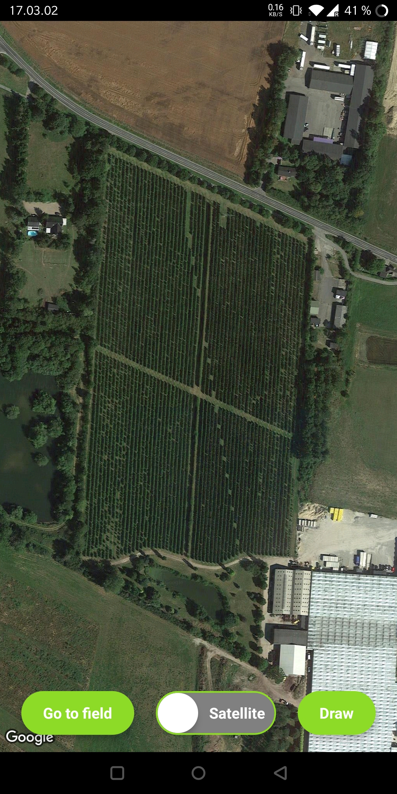
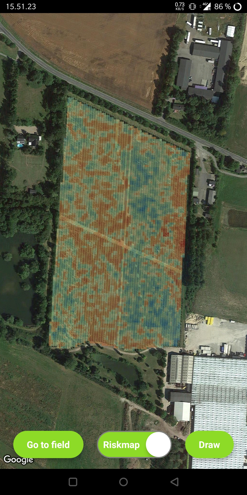
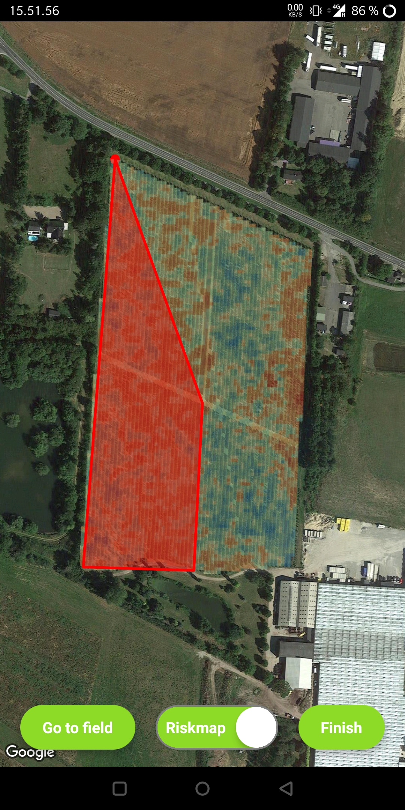
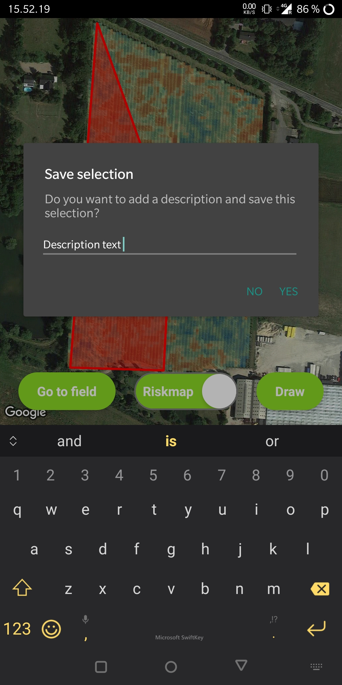

# FaunaST-app

This app is made with React Native for [Fauna Smart Technologies](https://faunasmarttechnologies.com/).

## Functionalities

- displays a map view using the Google Maps API (satellite mode)
- centers the map on a specific field near Odense, Denmark
- "Go to field" button recenters the map when clicked
- "Heatmap/Satellite" switch toggles on/off a heatmap overlay, over the base satellite map
- "Draw/Finish" button allows the user to start drawing a polygon over the map; when "Finish" is clicked, a dialog asks for a description. When the user taps "Yes", polygon and description are sent to the backend

## Dependencies

- **react** v.: 17.0.2
- [**react-native**](https://reactnative.dev/) v.: 0.68.2
- [**react-native-maps**](https://github.com/react-native-maps/react-native-maps) v.: ^0.31.1
- [**rn-toggle-switch**](https://github.com/prsn/react-native-toggle-switch) v.: ^1.0.2
- [**react-native-dialog**](https://www.npmjs.com/package/react-native-dialog) v.: ^9.2.2

## Repo Structure

    .
    ├── android                    # Android project directory
    ├── ios                        # iOS project directory
    ├── assets                     # Assets folder
    │   ├── fonts                  # Fonts folder
    │   ├── geojsons               # (not included) contains GeoJSON assets
    │   └── rasters                # (not included) contains raster images assets
    ├── components                 # Components folder
    ├── README.md                  # README.md file
    └── ...                        # Other, including App.js: here is the main code for this app (*)

### App.js structure (*)

- necessary imports
- global definitions of **the raster image**, **the coordinates of the field in Odense**, **the field in Odense as a location** and **the overlay properties**
- react states definitions
- fun `#a78de4` goToField: recenters the map on the base field
- [fun] handleDiscard: handles user selection "No" from the dialog
- [fun] handleSave: handles user selection "Yes" from the dialog (!missing API call to backend)
- [fun] createPolygonCoords: handles a tap on the MapView. If user is drawing, updates the polygon coordinates
- SafeAreaView: main component, excludes iOS' notch
- Dialog: dialog component
- MapView: main map component
- Circle: first drawing point component
- Polygon: drawing polygon component
- Overlay: heatmap overlay component
- TouchableOpacity: recenter button component
- Toggle: custom heatmap toggle component _[./components/toggle.js]_
- TouchableOpacity: draw button component
- styling definitions

## Screenshots

| Base view | Heatmap on | Polygon drawing | Description adding |
| --------- | ---------- | --------------- | ------------------ |
|  |  |  |  | 
